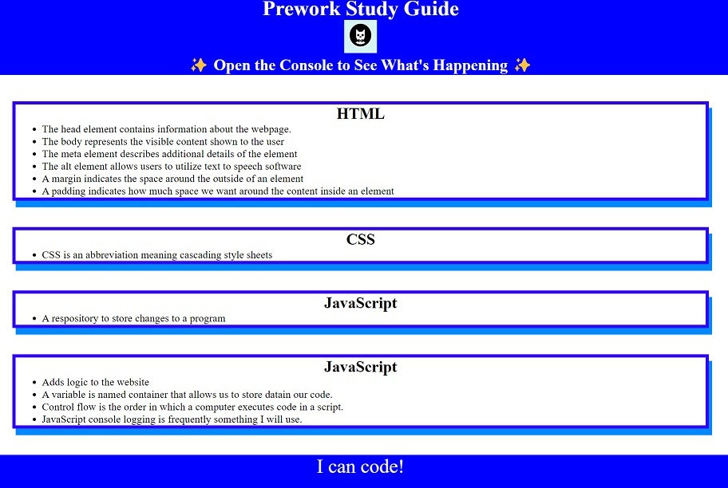

# Prework Study Guide Webpage

## Description

This is a website displaying information associated with the UW bootcamp. It is a pre-work assignment to prepare the student for the bootcamp. This web page was created to demonstrates and implements the usage of GitHub. By using GitHub the student has a better undestanding of a method used in professional software development. Specifically, the student learns version control. This website is constructed with command lines utilizing Command Line Interface software Git Bash.

## Table of Contents 

- [Installation](#installation)
- [Usage](#usage)
- [Credits](#credits)
- [License](#license)

## Installation

What are the steps required to install your project? Provide a step-by-step description of how to get the development environment running.

1. The student must download the starter code from bootcamp module 2 to their local machine.
2. The student must download the command line interface Git Bash.
3. The student must generate SSH keys to connec their local machine to their Git Hub account.
4. The student must install VS code desktop located here: https://code.visualstudio.com/
5. The student must install the extension called "open in browser" in vs code
6. When the open in browser extension is installed, click on index.html on the active directory and press the keyboard shortcut alt B.

## Usage

Provide instructions and examples for use. Include screenshots as needed.

1. The student can then edit the website from VS Code.
2. The student can update the Git Hub repository using Git Bash.

## Credits

List your collaborators, if any, with links to their GitHub profiles.

If you used any third-party assets that require attribution, list the creators with links to their primary web presence in this section.

If you followed tutorials, include links to those here as well.

This website was written by the instruction of the UW coding bootcamp.
The following tutorials were utilized as well as others not mentioned:
1. What makes up a web development project by The Full-Stack Blog: 
   https://developer.mozilla.org/en-US/docs/Web/CSS

2. Git Command cheat sheet: 
   https://education.github.com/git-cheat-sheet-education.pdf

3. Creating a CSS card class: 
   https://developer.mozilla.org/en-US/docs/Web/CSS

4. An introduction to GitHub by instructor Malaika Carpenter:  
   https://digital.gov/resources/an-introduction-github/
 
5. Creating a GitHub Repository with a README file: 
   https://courses.bootcampspot.com/courses/2937/pages/2-dot-3-6-create-a-github-repository-with-a-readme-file?module_item_id=779230

## License

Licensed under the MIT license.

---

🏆 The previous sections are the bare minimum, and your project will ultimately determine the content of this document. You might also want to consider adding the following sections.

## Badges

Badges aren't necessary, but they demonstrate street cred. Badges let other developers know that you know what you're doing. Check out the badges hosted by [shields.io](https://shields.io/). You may not understand what they all represent now, but you will in time.

## Features

If your project has a lot of features, list them here.

## How to Contribute

If you created an application or package and would like other developers to contribute to it, you can include guidelines for how to do so. The [Contributor Covenant](https://www.contributor-covenant.org/) is an industry standard, but you can always write your own if you'd prefer.

## Tests

Go the extra mile and write tests for your application. Then provide examples on how to run them here.
